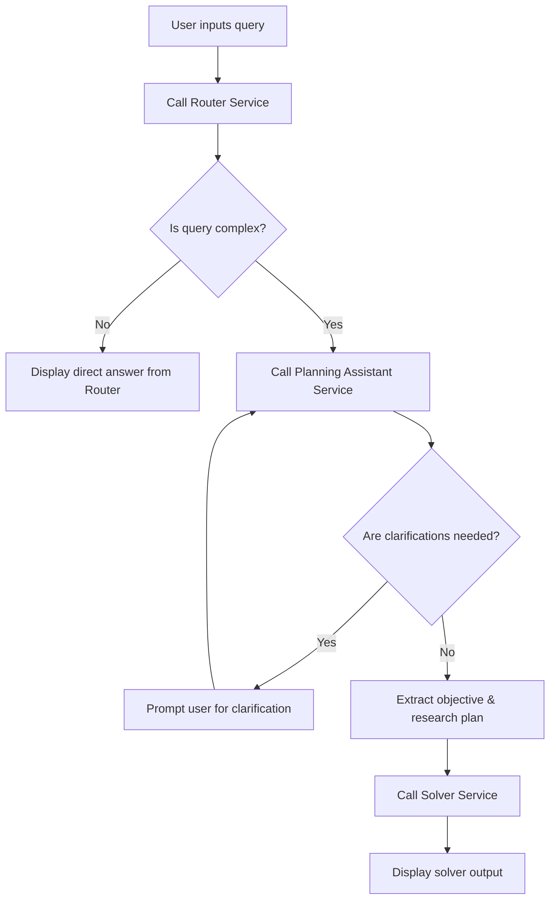

# deepresearch

```mermaid
flowchart TD
    A[User inputs query] --> B[Call Router Service]
    B --> C{Is query complex?}
    C -- No --> D[Display direct answer from Router]
    C -- Yes --> E[Call Planning Assistant Service]
    E --> F{Are clarifications needed?}
    F -- Yes --> G[Prompt user for clarification]
    G --> E
    F -- No --> H[Extract objective & research plan]
    H --> I[Call Solver Service]
    I --> J[Display solver output]

```
