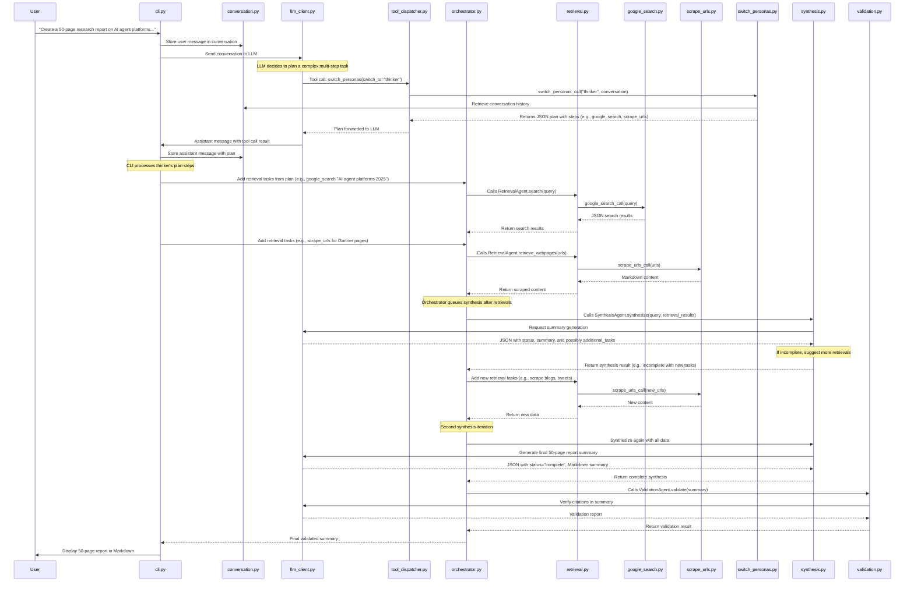

# Deep Research



## Microservices

Deep Research uses several microservices to handle different aspects of the research process:

1. **Workspace Agent**: Manages markdown documents and provides a natural language interface for document operations.
2. **Google Search**: Wrapper around Google Custom Search API for retrieving search results.
3. **Firecrawl**: Converts websites into LLM-ready markdown for analysis.
4. **Gemini**: Uses Google's Gemini model to analyze webpage content and answer queries.

## Docker Compose Setup

### Prerequisites

- [Docker](https://docs.docker.com/get-docker/) and [Docker Compose](https://docs.docker.com/compose/install/) installed
- API keys for the following services:
  - Anthropic Claude API
  - Google API (with Custom Search enabled)
  - Firecrawl API
  - Google Cloud Platform (with Vertex AI enabled)

### Configuration

The `docker-compose.yml` file has placeholder values that need to be replaced:

- `<YOUR_ANTHROPIC_API_KEY>`: Your Anthropic API key
- `<YOUR_GOOGLE_API_KEY>`: Your Google API key
- `<YOUR_GOOGLE_CSE_ID>`: Your Google Custom Search Engine ID
- `<YOUR_FIRECRAWL_API_KEY>`: Your Firecrawl API key
- `<YOUR_GCP_PROJECT_ID>`: Your Google Cloud Platform project ID

Also update the volume paths to match your local environment:

- `/path/to/your/workspace`: Local path to store workspace documents
- `/path/to/your/service-account.json`: Path to your GCP service account JSON file

### Building and Running

To build and start all services:

```bash
docker-compose up -d
```

This command will:

1. Build Docker images for all services if they don't exist
2. Create and start containers for each service
3. Run them in detached mode (-d flag)

### Managing Services

- **View logs for all services**:

  ```bash
  docker-compose logs -f
  ```

- **View logs for a specific service**:

  ```bash
  docker-compose logs -f workspace-agent
  ```

- **Stop all services**:

  ```bash
  docker-compose down
  ```

- **Rebuild a specific service after code changes**:

  ```bash
  docker-compose up -d --build workspace-agent
  ```

- **Restart a specific service**:

  ```bash
  docker-compose restart google-search
  ```

### Service Endpoints

Once running, the services will be available at:

- Workspace Agent: <http://localhost:8091>
- Google Search: <http://localhost:8085>
- Firecrawl: <http://localhost:8084>
- Gemini: <http://localhost:8090>

## Troubleshooting

- **Port Conflicts**: If you encounter port conflicts, modify the port mappings in the docker-compose.yml file.
- **Network Issues**: The `extra_hosts` configuration allows services to communicate with each other using `host.docker.internal`. If you experience connectivity issues, verify this is working correctly for your Docker setup.
- **API Limits**: Be aware of rate limits and quotas for the external APIs being used.
