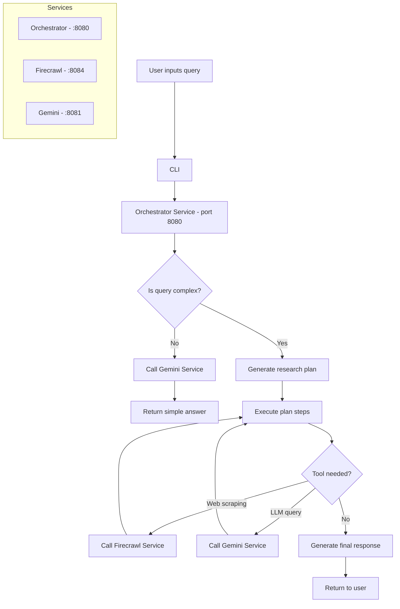

# Deep Research



## Quick Start

1. Set environment variables:

```bash
export OPENAI_API_KEY=your_key_here
export FIRECRAWL_API_KEY=your_key_here
export GEMINI_API_KEY=your_key_here
```

2. Start services:

```bash
docker compose up -d
```

3. Run CLI:

```bash
cd cli
pip install -r requirements.txt
python main.py
```
